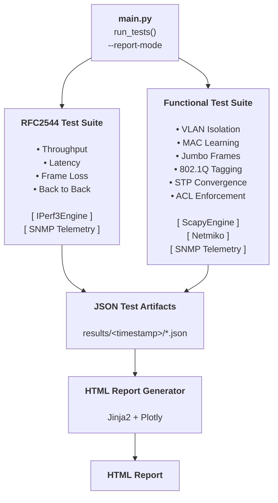

# Network Test Framework

## Overview

A Python-based network test framework for benchmarking switch performance and validating protocol behavior against real hardware — built as an open-source alternative to commercial tools like Ixia and Spirent.

The framework runs against a **Cisco Catalyst 3750** switch as the Device Under Test (DUT), with traffic generated and analyzed by two Ubuntu VMs running on a Dell PowerEdge R430 (Proxmox). All test traffic flows through the physical switch — results reflect real hardware behavior, not simulation.


---

## What This Tests

The framework answers two distinct questions:

**Does the switch perform well?** — RFC 2544 benchmark tests measure the switch's forwarding capacity using the industry-standard methodology. Results are expressed as throughput in Mbps, packet loss percentage, and latency in milliseconds at defined load levels.

**Does the switch behave correctly?** — Functional tests verify that the switch is correctly implementing the protocol behaviors it is configured for. Results are pass/fail with evidence — the exact frames sent and received are logged for every test.

---

## Lab Topology

```
orchestrator (10.0.0.10)
    │
    ├── SSH ──► traffic-generator (10.0.0.11 / 172.16.0.1)
    │                   └── iperf3 client / Scapy sender
    │                               │
    │                           Gi1/0/5
    │                               │
    │                      Cisco Catalyst 3750 (DUT)
    │                               │
    │                           Gi1/0/6
    │                               │
    └── SSH ──► traffic-analyzer  (10.0.0.12 / 172.16.0.2)
                        └── iperf3 server / Scapy capture
```

- **Management network:** 10.0.0.0/24 — orchestrator drives all tests over this network
- **Test traffic network:** 172.16.0.0/24 — all test traffic flows through the 3750 on this network
- Test traffic never touches the management network

---

## Architecture



---

## RFC 2544 Benchmark Tests

RFC 2544 (published 1999) is the industry standard for benchmarking network devices. It defines four specific tests so that results are comparable across vendors and platforms. Every serious network test team — and commercial tools like Ixia and Spirent — implement this same spec.

Tests are run at all seven RFC 2544 standard frame sizes (64, 128, 256, 512, 1024, 1280, 1472 bytes) plus 9000-byte jumbo frames as an extended test. This produces a complete performance profile showing how the switch behaves across the full range of traffic types.

### Throughput
**Goal:** Find the maximum rate at which the switch forwards frames with zero packet loss.

Uses a binary search algorithm starting at 100% of link capacity. If loss is detected the rate is halved; if no loss the rate is raised. Converges within 0.5% tolerance. This is the headline number — the switch's forwarding ceiling at each frame size.

**Why it matters:** A switch rated at 1G does not necessarily forward 1G of small frames without loss. The 3750's ASIC has a packet-per-second ceiling that is exposed at small frame sizes. Throughput at 64 bytes vs 1472 bytes tells you the real forwarding capacity of the hardware.

### Latency
**Goal:** Measure how long the switch takes to forward a frame at its maximum throughput rate.

Runs at the zero-loss throughput rate determined above, repeated 20 times per RFC 2544 specification. Reports min, average, and max latency. Rising latency under load indicates buffer buildup inside the switch.

**Why it matters:** A switch may forward frames without loss but introduce variable delay under load — a critical issue for latency-sensitive applications.

### Frame Loss Rate
**Goal:** Map how packet loss increases as offered load exceeds the switch's forwarding capacity.

Starts at 100% of link rate and steps down in 10% increments, recording loss percentage at each step. Stops after two successive zero-loss trials. Produces a loss curve per frame size.

**Why it matters:** The loss curve shows not just *where* the switch starts dropping, but *how steeply* loss increases under overload — characterizing whether it degrades gracefully or cliff-edges.

### Back-to-Back (Burst)
**Goal:** Find the maximum burst of back-to-back frames the switch can absorb without dropping any.

Sends increasing burst sizes at line rate until drops are detected, then narrows to find the maximum no-loss burst. Repeated 50 times per RFC 2544 specification, average reported.

**Why it matters:** Characterizes the switch's buffer depth — how much bursty traffic it can absorb before dropping. Critical for real-world traffic patterns that are inherently bursty.

---

## Functional Tests

Functional tests verify the switch is correctly implementing the protocol behaviors it is configured for. These use Scapy to craft specific frames at Layer 2 and observe exactly how the switch responds. Results are pass/fail with the frames sent and received logged as evidence.

### VLAN Isolation
**Goal:** Confirm traffic on one VLAN cannot be seen on another VLAN.

Sends a frame tagged with VLAN 10, captures on a port in a different VLAN. **Pass** if the frame does not arrive — the switch is correctly enforcing VLAN boundaries.

**Why it matters:** VLAN isolation is the primary traffic segmentation mechanism in switched networks. A failure here means traffic is leaking between segments that should be isolated.

### MAC Learning
**Goal:** Verify the switch learns source MAC addresses and stops flooding after the first frame.

Sends a burst of frames from a known source MAC, then queries the MAC address table via Netmiko. Confirms the MAC appears on the correct port and that subsequent frames are forwarded directly rather than flooded to all ports.

**Why it matters:** MAC learning is fundamental to switch operation. Without it, every frame is flooded to all ports — the switch behaves like a hub, saturating all links with every transmission.

### Jumbo Frames
**Goal:** Confirm 9000-byte frames are forwarded without fragmentation or drops when jumbo MTU is configured.

Sends a single 9000-byte frame and confirms it arrives intact on the analyzer. Checks switch interface counters for any error increments.

**Why it matters:** Jumbo frames are critical for storage, backup, and high-throughput server traffic. Misconfigured MTU causes silent fragmentation or drops that are difficult to diagnose.

### 802.1Q Tagging
**Goal:** Verify VLAN tags are preserved correctly end-to-end.

Sends a frame with a specific VLAN tag and inspects the received frame on the analyzer to confirm the tag is present and correct.

**Why it matters:** Incorrect tag handling causes traffic to land in the wrong VLAN or be dropped entirely — a common source of difficult-to-debug connectivity issues.

### STP Convergence
**Goal:** Measure how long the switch takes to resume forwarding after a link failure.

Runs continuous traffic while a link failure is simulated. Measures time from failure to traffic resumption. Compares against 802.1D (up to 30 seconds) and RSTP (under 1 second) targets.

**Why it matters:** STP convergence time directly impacts how long users are disconnected during a network failure. The difference between 802.1D and RSTP is the difference between a 30-second outage and a sub-second one.

### ACL Enforcement
**Goal:** Verify that permit and deny ACL rules produce correct forwarding behavior.

Pushes a test ACL to the switch via Netmiko, sends frames matching both permit and deny rules, and confirms traffic is forwarded or blocked accordingly. Restores original config after the test.

**Why it matters:** ACLs are the primary security enforcement mechanism on a switch. An ACL that does not block what it is supposed to block is a security failure.

---

## Live Switch Telemetry

During every test run — both RFC 2544 and functional — the framework polls the 3750's interface counters via SNMP before and after each test. The counter delta (TX/RX packets, errors, drops per port) is attached to every test result.

This correlates test-side observations with switch-side ground truth. When iperf3 reports packet loss, the telemetry shows exactly which interface dropped frames and by how much — closing the loop between what the test sees and what the switch reports.

---

## Engines

### IPerf3Engine (`framework/traffic/iperf3_engine.py`)
The performance measurement engine. Drives `iperf3` remotely via SSH on the traffic-generator VM, parses the JSON output, and returns structured results. Used exclusively by the RFC 2544 test suite.

- **TCP mode** — throughput measurement with retransmit tracking
- **UDP mode** — fixed-rate injection for frame loss and latency tests
- **Stepwise UDP** — iterates through bitrate steps for the frame loss curve

The iperf3 server runs as a systemd service on the analyzer VM and is always listening — no manual steps required between tests.

### ScapyEngine (`framework/traffic/scapy_engine.py`)
The protocol-level functional test engine. Scapy scripts are developed on the orchestrator and SCP'd to the generator and analyzer before execution. The orchestrator passes test parameters as CLI arguments — it controls what gets sent, the generator handles construction and transmission.

- Sends crafted Layer 2 frames with precise control over MAC addresses, VLAN tags, IP headers, and payload size
- Coordinates simultaneous send (generator) and capture (analyzer) over the management network
- Returns structured JSON results for the test runner to score

---

## Setup

### Requirements

- Linux environment (or similar Unix shell)
- Python 3.12+
- SSH access to lab hosts and switch
- `iperf3` installed on traffic-generator and traffic-analyzer VMs
- `python3-scapy` installed on traffic-generator and traffic-analyzer VMs
- SNMP community string configured on the 3750

### Install dependencies

```bash
cd /home/jimmy/network-test-framework
curl -LsSf https://astral.sh/uv/install.sh | sh
uv venv
source .venv/bin/activate
uv sync
```

### Configure credentials

Edit `config/credentials.yaml` with SSH credentials for the generator, analyzer, and switch. Edit `config/lab_topology.yaml` with IP addresses and interface names matching your lab.

---

## Project Layout

```text
network-test-framework/
├── main.py                        # CLI entry point
├── pyproject.toml
├── config/
│   ├── lab_topology.yaml          # IP addresses, interfaces, switch ports
│   └── credentials.yaml           # SSH and SNMP credentials (gitignored)
├── profiles/
│   ├── rfc2544_quick.yaml         # 3 frame sizes — fast dev runs
│   ├── rfc2544_full.yaml          # All 7 RFC 2544 frame sizes
│   └── rfc2544_extended.yaml      # Full suite + 9000-byte jumbo frames
├── framework/
│   ├── lab_secrets.py
│   ├── telemetry/
│   │   └── cisco_snmp.py          # SNMP counter polling + Netmiko MAC table
│   ├── traffic/
│   │   ├── iperf3_engine.py       # iperf3 subprocess wrapper
│   │   ├── scapy_engine.py        # Orchestrator-side Scapy coordinator
│   │   ├── scapy_send.py          # Runs on generator (SCP'd)
│   │   └── scapy_capture.py       # Runs on analyzer (SCP'd)
│   ├── tests/
│   │   ├── rfc2544.py             # RFC 2544 benchmark tests
│   │   ├── functional.py          # Functional test suite
│   │   ├── test_rfc2544.py        # Manual validation scripts
│   │   └── test_functional.py
│   └── reporting/
│       ├── report_generator.py    # Reads JSON results, renders report
│       └── templates/
│           └── report.html        # Jinja2 report template
├── results/
│   └── <timestamp>/               # One folder per test run
│       ├── throughput.json
│       ├── latency.json
│       ├── frame_loss.json
│       ├── back_to_back.json
│       └── <functional-test>.json
└── reports/
    └── <timestamp>_report.html    # Self-contained HTML report
```

---

## Running Tests

### Run full test suite

```bash
cd /home/jimmy/network-test-framework
source .venv/bin/activate
python3 main.py
```

Creates a timestamped results directory: `results/YYYY-MM-DD-HH-MM/`

### Generate report from latest results

```bash
python3 main.py --report
```

### Generate report from a specific results folder

```bash
python3 main.py --report results/YYYY-MM-DD-HH-MM
```

Output: `reports/YYYY-MM-DD-HH-MM_report.html`

The HTML report is fully self-contained — Plotly JS is embedded inline. Open it in any browser with no internet connection and no dependencies.

---

## Results Format

Every test result — RFC 2544 and functional — uses a consistent structure:

| Field | Description |
|-------|-------------|
| `test` | Test name |
| `passed` | Boolean pass/fail |
| `timestamp` | ISO 8601 timestamp |
| `duration_sec` | Test duration |
| `switch_counter_delta` | SNMP interface counter delta before/after |
| `details` | Test-specific metrics |
| `evidence` | Raw per-trial data |

Results are stored as individual JSON files per test for traceability. The `raw_json` blob from iperf3 is stripped before saving to keep file sizes manageable.
